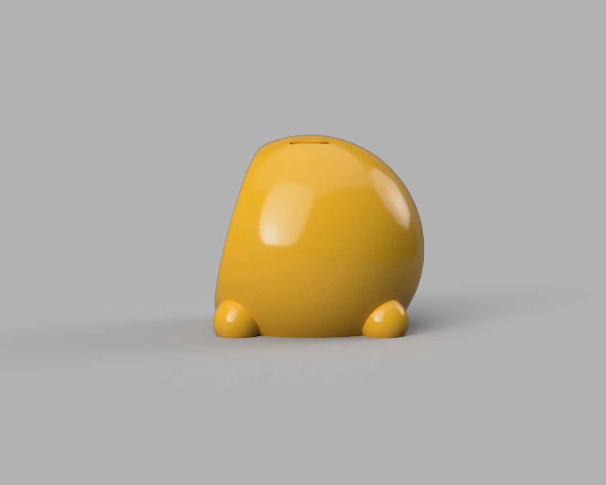
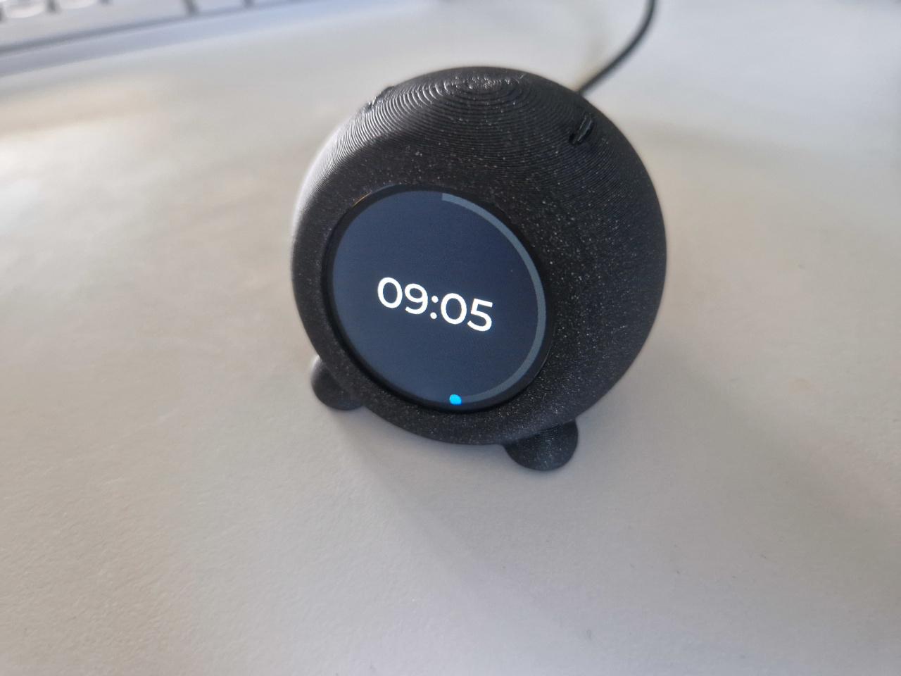

# IOT display ball

IOT display ball for SeeedStudio XIAO ESP32-S3







# BOM

* Seed studio XIAO ESP32S3
* Waveshare 1.28" round LCD display

# Development

Use PlatformIO plugin in Visual Studio Code

## Configure esp sdk
```
pio run -t menuconfig
```
